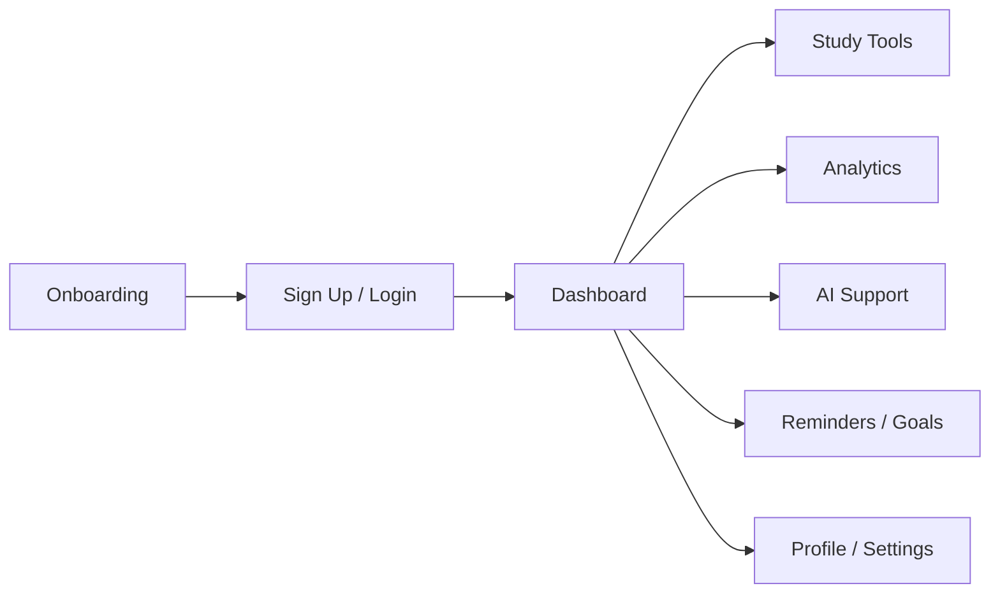

# Smart Vidya

Smart Vidya is a Flutter-based learning companion designed to support focused study, student progress, and smarter daily learning habits.

## Overview

This app brings together study tools, progress tracking, AI-assisted learning, and personalization in one mobile experience. It starts with authentication and onboarding, then routes the user into a dashboard where study, analytics, reminders, and support tools are available.

### What the app includes

- Authentication and sign-up flow
- Personalized dashboard
- Study streak and progress analytics
- Pomodoro timer for focused learning
- Smart reminders and study goals
- Quiz and class modules
- Reading support and note assistance
- AI chat and study helper screens
- Camera-based features and face detection support
- Profile and settings management

## App Flow

The app is organized around a simple learning journey:



### User journey

The app checks whether the user is already logged in. If yes, it opens the dashboard directly. If not, it sends the user to the sign-up screen first.

From there, the dashboard becomes the central hub for study tools, progress views, reminders, and support features.

## Features

### Core learning tools

- Pomodoro timer for structured study sessions
- Study goals and streak tracking
- Quiz and class-oriented screens
- Reading support and notes helper screens

### Progress and analytics

- Progress analytics
- Visual charts for learning trends
- Study streak visibility
- Dashboard summaries for quick status checks

### AI and smart assistance

- AI chat support
- Smart reminder workflows
- Camera and face detection integration
- ML-powered emotion model support through the bundled TFLite asset

### Personalization

- Profile management
- Settings screen
- Social sign-in assets and login support

## Architecture

Smart Vidya is built as a modular Flutter app with feature-based screens.

- `lib/main.dart` handles app startup and login routing.
- `lib/screens/signup_screen.dart` handles user entry into the app.
- `lib/screens/dashboard_screen.dart` acts as the main home hub.
- `lib/screens/*` contains focused modules for study, analytics, reminders, AI, and profile features.
- `assets/` contains the bundled image, audio, and TFLite model assets used by the app.

## Tech Stack

- Flutter
- Dart
- Firebase Auth
- Google Sign-In
- SharedPreferences
- Camera
- Google ML Kit Face Detection
- TensorFlow Lite
- fl_chart
- flutter_local_notifications
- audioplayers

## Project Structure

```text
lib/
	main.dart
	screens/
assets/
	images/
	sounds/
	emotion_model.tflite
test/
android/
ios/
web/
windows/
macos/
linux/
```

## Getting Started

### Prerequisites

- Flutter SDK 3.x
- Dart SDK compatible with Flutter
- Android Studio, VS Code, or another Flutter-capable IDE
- A connected device, emulator, or simulator

### Install dependencies

```bash
flutter pub get
```

### Run the app

```bash
flutter run
```

## Build

```bash
flutter build apk
```

You can also build for iOS, web, desktop, or release channels depending on your target platform.

## Assets

The app includes bundled resources for UI and ML support:

- `assets/images/` for logos and visual assets
- `assets/sounds/alarm.wav` for reminder audio
- `assets/emotion_model.tflite` for emotion-related ML support

## Notes

- Login state is stored locally using `SharedPreferences`.
- The app is configured with a dark theme by default.
- Firebase and Google sign-in are included for authentication flows.
